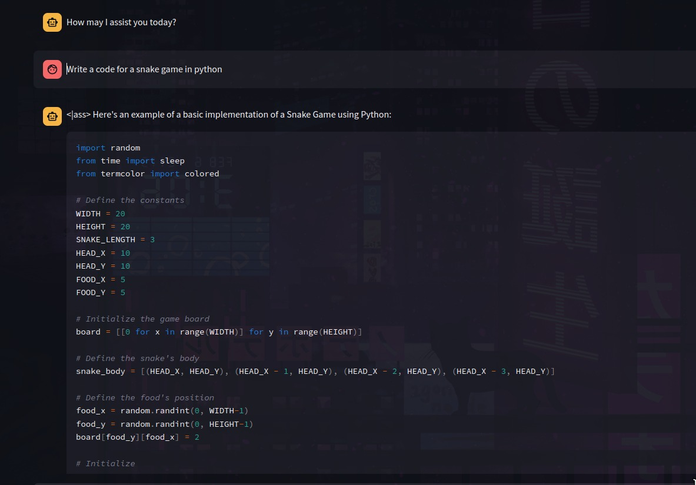

# JARVIS Assistant


JARVIS Assistant is a chat interface powered by advanced AI models, designed to assist users in natural language conversations. This repository contains the code for creating a chat interface that can be customized with various AI models.

## Screenshots


## Table of Contents

- [Overview](#overview)
- [Features](#features)
- [Prerequisites](#prerequisites)
- [Getting Started](#getting-started)
- [Usage](#usage)
- [Customization](#customization)
- [Data Storage](#data-storage)
- [License](#license)

## Overview

JARVIS Assistant is a versatile chat interface that integrates with Hugging Face AI models to provide conversational AI capabilities. It offers a user-friendly interface to interact with AI models, and it can be configured with different models and data sources.

## Features

- Interactive chat interface.
- Customizable AI model selection.
- Support for various AI models, including GGUF and HF models.
- Data storage for training and conversations.
- Clear chat history.
- URL handling for website data collection.

## Prerequisites

Before you begin, ensure you have met the following requirements:

- Python 3.7 or higher installed.
- Install the required Python packages by running `pip install -r requirements.txt`.
- A Hugging Face API key (if you plan to use Hugging Face models).

## Getting Started

1. Clone this repository:

```shell
git clone https://github.com/praharshbhatt/jarvis-assistant.git
cd jarvis-assistant
```

2. Create a virtual environment (recommended):
```shell
python -m venv venv
source venv/bin/activate  # On Windows, use venv\Scripts\activate
```


3. Install the required Python packages:

```shell
pip install -r requirements.txt
```

4. Set up your environment variables:

Create a .env file in the root directory.
Add your Hugging Face API key as follows:

```shell
HUGGINGFACE_API_KEY=your_api_key_here
```

Run the app:

```shell
streamlit run main.py
```

* Usage
- Choose a model from the model selection dropdown.
- Enter your query in the chat interface.
- Interact with the AI model in the chat interface.

# Customization
You can customize the chat interface by modifying the main.py file. You can change the UI layout, add new models, or implement additional features to suit your needs.

# Data Storage
The repository provides a data storage mechanism for website data collection. The collected data is stored in the data/training_data/websites directory.

# License
This project is licensed under the terms of the MIT license. See the LICENSE file for more details.


Happy chatting with JARVIS Assistant!